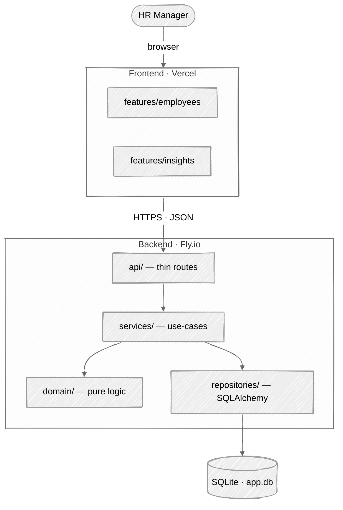
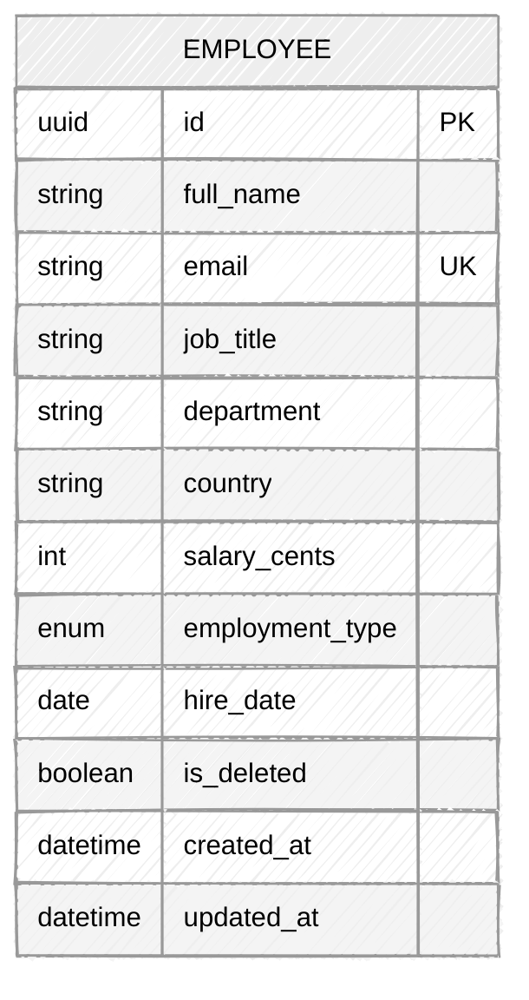
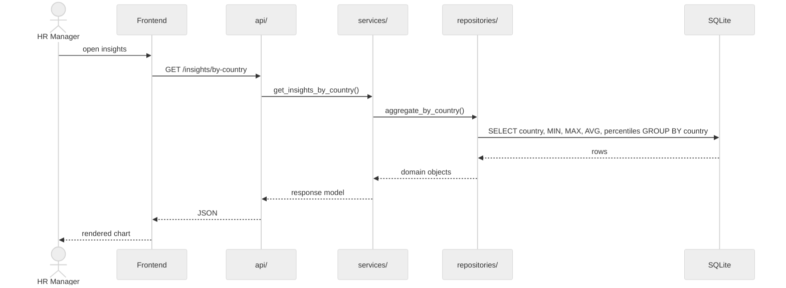

# Architecture

## System

Arrows point in the dependency direction. `domain/` depends on nothing; everything that
matters depends on `domain/`.

## Data model

One aggregate. No joins in v1.

Indexes: `email` (unique), `country`, `job_title`, composite `(country, is_deleted)` for
the insight queries.

## Request: "salary insights by country"

Aggregation happens in SQL. The frontend never sees 10K rows.

## Invariants

- Dependencies point downward only.
- `domain/` imports nothing — no framework, no I/O.
- `repositories/` is the only layer with SQLAlchemy imports.
- Insights are SQL aggregates, not Python loops over rows.
- Soft-deleted rows are excluded from every default query.
